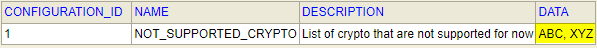

# Crypto Recommendation Service

Crypto Recommendation Service developed to help end users analyze historical prices for different set of crypto currencies. 
Service provides REST endpoints that can be used by different clients.

Technologies used:
- Java 17
- Spring Boot / Spring Batch
- H2 In-memory database

Application consists of two logical parts:
- Importing data from file sources
- API for gathering information

### Importing part
Implementation based on Spring Batch and provide ability to import set of file **simultaneously** by using partitioning. 
Additionally, there is a possibility to **restrict import** of specific files based on their names.

Restrictions can be set by changing Configuration property in database (in simple case using H2 console):


The value should be comma separated. 

### API
The endpoints available for use:
- **GET /api/v1/crypto/{symbol}** - endpoint that will return the oldest/newest/min/max values for a requested
  crypto
- **GET /api/v1/crypto/best?date={date}** -  endpoint that will return the crypto with the highest normalized range for a
  specific day
- **GET /api/v1/crypto/sorted** - endpoint that will return a descending sorted list of all the cryptos,
  comparing the normalized range

API rate limiter (Bucket4j) implemented and limit of requests from one IP is set to 5.
Following response will be returned when the count of requests reaches limit.
```json
{
  "status": 429,
  "message": "Too many requests"
}
```

## Running the service
Jib plugin is used to achieve containerization of the application.
For creating of images tarball approach chosen due to limited information about possible environments. 

```shell
git clone git@github.com:AnatoliLevakou/crypto-recommendation-service.git
cd crypto-recommendation-service
.\gradlew jibBuildTar
<copy jib-image.tar desired destination>
docker load --input ./jib-image.tar
docker run -d -p 8080:8080 --name recommendation-service crypto-recommendation-service:1.0-SNAPSHOT
```
API become available by http://127.0.0.1:8080/api/v1/crypto/*

### API Request / Response examples
Descending sorted list of all the cryptos, comparing the normalized range
```curl
curl --location 'http://localhost:8080/api/v1/crypto/sorted'
```
```json
[
    {
        "symbol": "ETH",
        "oldestPrice": 3715.3200,
        "newestPrice": 2672.5000,
        "minPrice": 2336.5200,
        "maxPrice": 3828.1100,
        "normRange": 0.63838101107630150822590861623269
    },
    {
        "symbol": "XRP",
        "oldestPrice": 0.8298,
        "newestPrice": 0.5867,
        "minPrice": 0.5616,
        "maxPrice": 0.8458,
        "normRange": 0.50605413105413105413105413105413
    },
    {
        "symbol": "DOGE",
        "oldestPrice": 0.1702,
        "newestPrice": 0.1415,
        "minPrice": 0.1290,
        "maxPrice": 0.1941,
        "normRange": 0.50465116279069767441860465116279
    },
    {
        "symbol": "LTC",
        "oldestPrice": 148.1000,
        "newestPrice": 109.6000,
        "minPrice": 103.4000,
        "maxPrice": 151.5000,
        "normRange": 0.46518375241779497098646034816248
    },
    {
        "symbol": "BTC",
        "oldestPrice": 46813.2100,
        "newestPrice": 38415.7900,
        "minPrice": 33276.5900,
        "maxPrice": 47722.6600,
        "normRange": 0.43412110435594512538694619851373
    }
]
```
Crypto with the highest normalized range for a specific day
```curl
curl --location 'http://127.0.0.1:8080/api/v1/crypto/best?date=2022-01-01'
```
```json
{
  "symbol": "XRP",
  "oldestPrice": 0.8298,
  "newestPrice": 0.8458,
  "minPrice": 0.8298,
  "maxPrice": 0.8458,
  "normRange": 0.01928175463967221017112557242709
}
```
Oldest/newest/min/max values for a requested crypto
```curl
curl --location 'http://localhost:8080/api/v1/crypto/BTC'
```
```json
{
  "symbol": "BTC",
  "oldestPrice": 46813.2100,
  "newestPrice": 38415.7900,
  "minPrice": 33276.5900,
  "maxPrice": 47722.6600,
  "normRange": 0.43412110435594512538694619851373
}
```
Problem message in case requested currency not exists in service
```curl
curl --location 'http://localhost:8080/api/v1/crypto/XYZ'
```
```json
{
  "type": "about:blank",
  "title": "Not Found",
  "status": 404,
  "detail": "Requested crypto XYZ not exist in system.",
  "instance": "/api/v1/crypto/XYZ"
}
```

## Limitations
- Import stage does not track state of the imported files. This means each time files will be re-imported from scratch.
- In-memory database is used. Due to that the amount of imported data is limited by memory. Dedicated DB
need to be configured to avoid this.
- Tests cover only MVP and need to be improved.